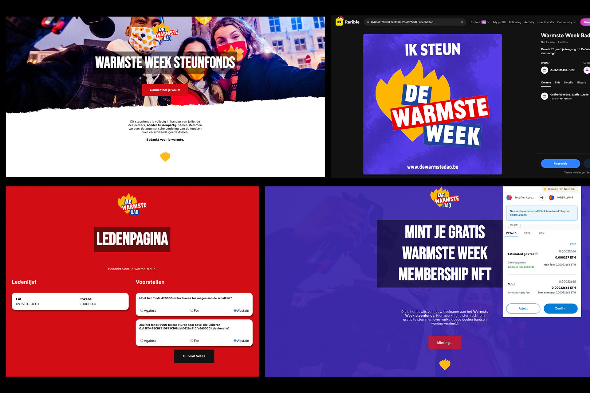
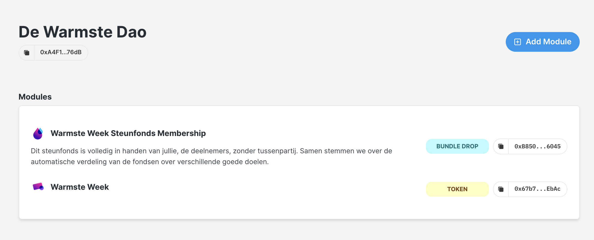
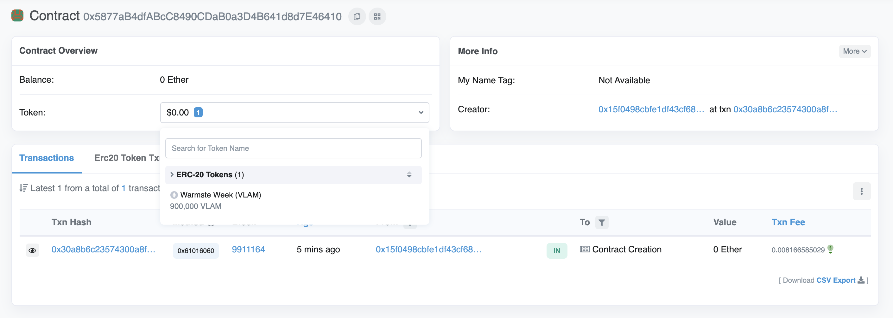

# Building a Charity DAO

## About This Project
At the end of the day a DAO is just a group of strangers with a shared bank account that vote on how to use that bank account.
Voting powers can be made custom and transparent through a set of rules in a smart contract.

## Tools & Workflow
* Replit to deploy code & live development
* Metamask as a wallet
* AlchemyAPI to broadcast contract creation
* Rinkeby network to test
* No databases were used, all is stored on chain. Thirdweb helped to deploy the SDK for NFTs and Voting tokens
* Made with Javascript & React

**Setup client app for DAO**
* 💻 Create DAO dashboard
* 🌈 Connect to wallet functions

**Create membership NFTs**
* 🌈 Deploy NFT bundle.
* 🚀 Deploy NFT metadata.
* 🤠 Letting users mint NFTs.

https://rinkeby.rarible.com/token/0xb850176b75f27c1898b25e7177dafef3cc666045:1?tab=owners

**Create your own token + on-chain governance**
* 🔌 Deploy ERC-20 contract
* 🔎 Show off token holders on DAO dashboard
* 🏹 Building a treasury + governance
* 🚀 Let users vote on proposals

https://rinkeby.etherscan.io/address/0x5877aB4dfABcC8490CDaB0a3D4B641d8d7E46410

**Wrapping Up**
* 🔥 Finishing touches on the UI & error handeling.

Created with https://app.buildspace.so/. Big recommendation to get into Web3.
